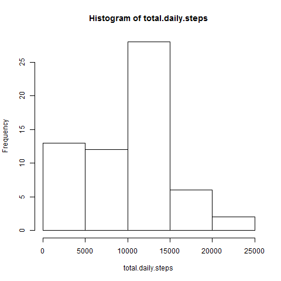
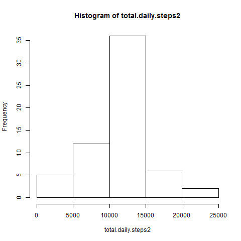
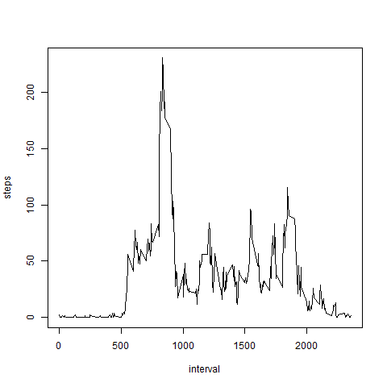

Loading and preprocessing the data
----------------------------------

### Read in the data to the dataset

#### Set the working directory variables.

Note: Set working.directory and short.path.to.file to whatever you need
to run this script.

    working.directory <- "~/DataScience/coursera/Assignments/Reproducible_Research"
    short.path.to.file <- "./repdata_data_activity/activity.csv"

#### Set the working directory

    setwd(working.directory)

#### Read the data table into variable: raw

    raw <- read.csv(short.path.to.file)

What is mean total number of steps taken per day?
-------------------------------------------------

#### Subset the sum of the steps by date.

For this part of the assignment, you can ignore the missing values in
the dataset.

    total.daily.steps <- tapply(raw$steps, raw$date, sum, na.rm = TRUE)

#### Make a histogram of the total number of steps taken each day.

    png("plot1.png")
    hist(total.daily.steps)
    dev.off()

    ## png 
    ##   2

    

Histogram: Total Number of Steps Taken Each Day

#### Calculate and report the mean and median of the total number of steps taken per day.

Mean and median number of steps taken per day.

    mean.daily.steps <- aggregate(steps ~ date, data = raw, FUN = mean, na.action = na.omit)
    median.daily.steps <- aggregate(steps ~ date, data = raw, FUN = median, na.rm = TRUE)

#### Mean of steps taken each day are in the vector: mean.daily.steps

    mean.daily.steps

    ##          date      steps
    ## 1  2012-10-02  0.4375000
    ## 2  2012-10-03 39.4166667
    ## 3  2012-10-04 42.0694444
    ## 4  2012-10-05 46.1597222
    ## 5  2012-10-06 53.5416667
    ## 6  2012-10-07 38.2465278
    ## 7  2012-10-09 44.4826389
    ## 8  2012-10-10 34.3750000
    ## 9  2012-10-11 35.7777778
    ## 10 2012-10-12 60.3541667
    ## 11 2012-10-13 43.1458333
    ## 12 2012-10-14 52.4236111
    ## 13 2012-10-15 35.2048611
    ## 14 2012-10-16 52.3750000
    ## 15 2012-10-17 46.7083333
    ## 16 2012-10-18 34.9166667
    ## 17 2012-10-19 41.0729167
    ## 18 2012-10-20 36.0937500
    ## 19 2012-10-21 30.6284722
    ## 20 2012-10-22 46.7361111
    ## 21 2012-10-23 30.9652778
    ## 22 2012-10-24 29.0104167
    ## 23 2012-10-25  8.6527778
    ## 24 2012-10-26 23.5347222
    ## 25 2012-10-27 35.1354167
    ## 26 2012-10-28 39.7847222
    ## 27 2012-10-29 17.4236111
    ## 28 2012-10-30 34.0937500
    ## 29 2012-10-31 53.5208333
    ## 30 2012-11-02 36.8055556
    ## 31 2012-11-03 36.7048611
    ## 32 2012-11-05 36.2465278
    ## 33 2012-11-06 28.9375000
    ## 34 2012-11-07 44.7326389
    ## 35 2012-11-08 11.1770833
    ## 36 2012-11-11 43.7777778
    ## 37 2012-11-12 37.3784722
    ## 38 2012-11-13 25.4722222
    ## 39 2012-11-15  0.1423611
    ## 40 2012-11-16 18.8923611
    ## 41 2012-11-17 49.7881944
    ## 42 2012-11-18 52.4652778
    ## 43 2012-11-19 30.6979167
    ## 44 2012-11-20 15.5277778
    ## 45 2012-11-21 44.3993056
    ## 46 2012-11-22 70.9270833
    ## 47 2012-11-23 73.5902778
    ## 48 2012-11-24 50.2708333
    ## 49 2012-11-25 41.0902778
    ## 50 2012-11-26 38.7569444
    ## 51 2012-11-27 47.3819444
    ## 52 2012-11-28 35.3576389
    ## 53 2012-11-29 24.4687500

#### Median of daily steps are in the vector: median.daily.steps

    median.daily.steps

    ##          date steps
    ## 1  2012-10-02     0
    ## 2  2012-10-03     0
    ## 3  2012-10-04     0
    ## 4  2012-10-05     0
    ## 5  2012-10-06     0
    ## 6  2012-10-07     0
    ## 7  2012-10-09     0
    ## 8  2012-10-10     0
    ## 9  2012-10-11     0
    ## 10 2012-10-12     0
    ## 11 2012-10-13     0
    ## 12 2012-10-14     0
    ## 13 2012-10-15     0
    ## 14 2012-10-16     0
    ## 15 2012-10-17     0
    ## 16 2012-10-18     0
    ## 17 2012-10-19     0
    ## 18 2012-10-20     0
    ## 19 2012-10-21     0
    ## 20 2012-10-22     0
    ## 21 2012-10-23     0
    ## 22 2012-10-24     0
    ## 23 2012-10-25     0
    ## 24 2012-10-26     0
    ## 25 2012-10-27     0
    ## 26 2012-10-28     0
    ## 27 2012-10-29     0
    ## 28 2012-10-30     0
    ## 29 2012-10-31     0
    ## 30 2012-11-02     0
    ## 31 2012-11-03     0
    ## 32 2012-11-05     0
    ## 33 2012-11-06     0
    ## 34 2012-11-07     0
    ## 35 2012-11-08     0
    ## 36 2012-11-11     0
    ## 37 2012-11-12     0
    ## 38 2012-11-13     0
    ## 39 2012-11-15     0
    ## 40 2012-11-16     0
    ## 41 2012-11-17     0
    ## 42 2012-11-18     0
    ## 43 2012-11-19     0
    ## 44 2012-11-20     0
    ## 45 2012-11-21     0
    ## 46 2012-11-22     0
    ## 47 2012-11-23     0
    ## 48 2012-11-24     0
    ## 49 2012-11-25     0
    ## 50 2012-11-26     0
    ## 51 2012-11-27     0
    ## 52 2012-11-28     0
    ## 53 2012-11-29     0

What is the average daily activity pattern?
-------------------------------------------

Restating the question: calculate the mean of the steps subsetted for
interval across all of the days.

    daily.pattern <- aggregate(steps ~ interval, data = raw, FUN = mean, na.action = na.omit)
    png("plot2.png")
    plot(daily.pattern, type = "l")
    dev.off()

    ## png 
    ##   2

    knitr::include_graphics("./images/plot2.png")

Time series plot: Mean of Steps per Interval Across All of the Days

What is the maximum measured interval mean?

    max.dp <- max(daily.pattern$steps)
    daily.pattern[daily.pattern$steps == max.dp,]

    ##     interval    steps
    ## 104      835 206.1698

Answer: Interval \# 835 contains the maximum number of mean steps:
206.1698 steps.

Imputing missing values
-----------------------

### Calculate and report the number of missing values.

    length(raw$steps[is.na(raw$steps)])

    ## [1] 2304

Answer: There are 2304 missing values.

### Now actually fill in the missing values and create a dataset without NAs to find the daily mean. Here the mean of the daily interval will be used.

NAs were omitted to calculate the mean earlier to create the vector:
daily.pattern Create a new vector using the daily pattern of interval
means to substitute the NAs for each day.

#### About the script

-   Read each line of the data table
-   If the steps column is NA value then read the interval for that
    line.
-   Look up that interval in the table and store it in x: daily.pattern
-   In the data set, exchange NA for x
-   continue the actions throughout the dataset

<!-- -->

    raw2 <- raw
    i <- numeric()
    j <- numeric(1)
    interval <- numeric(1)
    x.interval <- numeric(1)
    j <- length(raw2$steps)

    for (i in 1:j){
            if (is.na(raw2$steps[i]) == TRUE) {
                    interval <- raw2[i, 3]
                    x.interval <- daily.pattern[daily.pattern$interval == interval,2]
                    raw2[i,1] <- x.interval
            }
    }

#### Now the data obtained will be used to answer the questions as put forth.

##### What is the mean total number of steps taken per day?

##### This time the NAs have been substituted with the corresponding interval means.

    total.daily.steps2 <- tapply(raw2$steps, raw2$date, sum)

##### Make a histogram of the total number of steps taken each day.

    png("plot3.png")
    hist(total.daily.steps2)
    dev.off

    ## function (which = dev.cur()) 
    ## {
    ##     if (which == 1) 
    ##         stop("cannot shut down device 1 (the null device)")
    ##     .External(C_devoff, as.integer(which))
    ##     dev.cur()
    ## }
    ## <bytecode: 0x05b07df0>
    ## <environment: namespace:grDevices>

    

Histogram: Adjusted Total Number of Steps Taken Each Day

##### The question requests a calculation for mean and median number of steps taken per day.

    mean.daily.steps2 <- aggregate(steps ~ date, data = raw2, FUN = mean)
    median.daily.steps2 <- aggregate(steps ~ date, data = raw2, FUN = median)

##### The corrected mean number of steps taken per day.

    print(mean.daily.steps2)

    ##          date      steps
    ## 1  2012-10-01 37.3825996
    ## 2  2012-10-02  0.4375000
    ## 3  2012-10-03 39.4166667
    ## 4  2012-10-04 42.0694444
    ## 5  2012-10-05 46.1597222
    ## 6  2012-10-06 53.5416667
    ## 7  2012-10-07 38.2465278
    ## 8  2012-10-08 37.3825996
    ## 9  2012-10-09 44.4826389
    ## 10 2012-10-10 34.3750000
    ## 11 2012-10-11 35.7777778
    ## 12 2012-10-12 60.3541667
    ## 13 2012-10-13 43.1458333
    ## 14 2012-10-14 52.4236111
    ## 15 2012-10-15 35.2048611
    ## 16 2012-10-16 52.3750000
    ## 17 2012-10-17 46.7083333
    ## 18 2012-10-18 34.9166667
    ## 19 2012-10-19 41.0729167
    ## 20 2012-10-20 36.0937500
    ## 21 2012-10-21 30.6284722
    ## 22 2012-10-22 46.7361111
    ## 23 2012-10-23 30.9652778
    ## 24 2012-10-24 29.0104167
    ## 25 2012-10-25  8.6527778
    ## 26 2012-10-26 23.5347222
    ## 27 2012-10-27 35.1354167
    ## 28 2012-10-28 39.7847222
    ## 29 2012-10-29 17.4236111
    ## 30 2012-10-30 34.0937500
    ## 31 2012-10-31 53.5208333
    ## 32 2012-11-01 37.3825996
    ## 33 2012-11-02 36.8055556
    ## 34 2012-11-03 36.7048611
    ## 35 2012-11-04 37.3825996
    ## 36 2012-11-05 36.2465278
    ## 37 2012-11-06 28.9375000
    ## 38 2012-11-07 44.7326389
    ## 39 2012-11-08 11.1770833
    ## 40 2012-11-09 37.3825996
    ## 41 2012-11-10 37.3825996
    ## 42 2012-11-11 43.7777778
    ## 43 2012-11-12 37.3784722
    ## 44 2012-11-13 25.4722222
    ## 45 2012-11-14 37.3825996
    ## 46 2012-11-15  0.1423611
    ## 47 2012-11-16 18.8923611
    ## 48 2012-11-17 49.7881944
    ## 49 2012-11-18 52.4652778
    ## 50 2012-11-19 30.6979167
    ## 51 2012-11-20 15.5277778
    ## 52 2012-11-21 44.3993056
    ## 53 2012-11-22 70.9270833
    ## 54 2012-11-23 73.5902778
    ## 55 2012-11-24 50.2708333
    ## 56 2012-11-25 41.0902778
    ## 57 2012-11-26 38.7569444
    ## 58 2012-11-27 47.3819444
    ## 59 2012-11-28 35.3576389
    ## 60 2012-11-29 24.4687500
    ## 61 2012-11-30 37.3825996

##### The corrected median number of steps taken per day.

    print(median.daily.steps2)

    ##          date    steps
    ## 1  2012-10-01 34.11321
    ## 2  2012-10-02  0.00000
    ## 3  2012-10-03  0.00000
    ## 4  2012-10-04  0.00000
    ## 5  2012-10-05  0.00000
    ## 6  2012-10-06  0.00000
    ## 7  2012-10-07  0.00000
    ## 8  2012-10-08 34.11321
    ## 9  2012-10-09  0.00000
    ## 10 2012-10-10  0.00000
    ## 11 2012-10-11  0.00000
    ## 12 2012-10-12  0.00000
    ## 13 2012-10-13  0.00000
    ## 14 2012-10-14  0.00000
    ## 15 2012-10-15  0.00000
    ## 16 2012-10-16  0.00000
    ## 17 2012-10-17  0.00000
    ## 18 2012-10-18  0.00000
    ## 19 2012-10-19  0.00000
    ## 20 2012-10-20  0.00000
    ## 21 2012-10-21  0.00000
    ## 22 2012-10-22  0.00000
    ## 23 2012-10-23  0.00000
    ## 24 2012-10-24  0.00000
    ## 25 2012-10-25  0.00000
    ## 26 2012-10-26  0.00000
    ## 27 2012-10-27  0.00000
    ## 28 2012-10-28  0.00000
    ## 29 2012-10-29  0.00000
    ## 30 2012-10-30  0.00000
    ## 31 2012-10-31  0.00000
    ## 32 2012-11-01 34.11321
    ## 33 2012-11-02  0.00000
    ## 34 2012-11-03  0.00000
    ## 35 2012-11-04 34.11321
    ## 36 2012-11-05  0.00000
    ## 37 2012-11-06  0.00000
    ## 38 2012-11-07  0.00000
    ## 39 2012-11-08  0.00000
    ## 40 2012-11-09 34.11321
    ## 41 2012-11-10 34.11321
    ## 42 2012-11-11  0.00000
    ## 43 2012-11-12  0.00000
    ## 44 2012-11-13  0.00000
    ## 45 2012-11-14 34.11321
    ## 46 2012-11-15  0.00000
    ## 47 2012-11-16  0.00000
    ## 48 2012-11-17  0.00000
    ## 49 2012-11-18  0.00000
    ## 50 2012-11-19  0.00000
    ## 51 2012-11-20  0.00000
    ## 52 2012-11-21  0.00000
    ## 53 2012-11-22  0.00000
    ## 54 2012-11-23  0.00000
    ## 55 2012-11-24  0.00000
    ## 56 2012-11-25  0.00000
    ## 57 2012-11-26  0.00000
    ## 58 2012-11-27  0.00000
    ## 59 2012-11-28  0.00000
    ## 60 2012-11-29  0.00000
    ## 61 2012-11-30 34.11321

Do these values differ from the estimates from the first part of the
assignment? Yes, the new values display more of a central tendency that
is less skewed toward zero. Also, there are fewer medians of zero.

What is the impact of imputting missing data on the estimates of the
total daily number of steps? This seems simple to answer. It is tough to
add data points without affecting accuracy of the method. It is
difficult to say unless one knows the reason for the NA values. In this
case, after a cursory scan of the data, it appears that most of the NA
values occurred early in the dataset. Replacing the NA values with the
means may make the data look prettier; however, it may create error in
measurement, prediction or estimation. On the other hand, there may be a
advantage to substituting the NAs especially if the daily pattern is
very regular. In short, the impact of imputting missing data can be to
introduce error or reduce error or have no effect. Perhaps there is a
higer probability of introducing error by adding data. On the other
hand, with limited data resoloution there may be advantages to filling
in the gaps to smooth the curve. In the best case scenario with
unlimited funding an inquiry into the cause of the NAs would be a
reasonable solution. Also, a repeat of the experiment may be warranted.

Are there differences in activity patterns between weekdays and weekends?
-------------------------------------------------------------------------

To answer this questin a new column 'day' will be added to a forked data
frame to contain the factor of two levels: "Weekday","Weekend"

Create a dataset fork named 'raw3'.

    raw3 <- raw2

Initialize the variables.

    i <- numeric(1)
    fac.length <- numeric(1)
    day.check <- character(1)

Create a new empty variable/column named 'day' within the forked
dataset.

    fac.length <- length(raw3$steps)
    raw3$day <- factor(fac.length, levels = c("weekday", "weekend"))

Search and select for day type and enter the result into the new column.

    for (i in 1:fac.length){
            day.check <- weekdays(strptime(raw3[i, 2], format = "%Y-%m-%d"))
            if (day.check == "Saturday" | day.check == "Sunday"){
                    raw3[i, 4] <- "weekend"} else {raw3[i, 4] <- "weekday"}
    }

##### The means will be calculated and plotted using the table 'raw3'.

Mean steps for weekday intervals

    # aggregate(steps ~ interval, data = raw3[raw3$day == "weekday",], mean)
    png("plot4.png")
    plot(aggregate(steps ~ interval, data = raw3[raw3$day == "weekday",], mean), type = "l")
    dev.off()

    ## png 
    ##   2

    

Time Series: Mean Steps for Weekday Intervals

Mean steps for weekend intervals

    # aggregate(steps ~ interval, data = raw3[raw3$day == "weekend",], mean)
    png("plot5.png")
    plot(aggregate(steps ~ interval, data = raw3[raw3$day == "weekend",], mean), type = "l")
    dev.off()

    ## png 
    ##   2

    knitr::include_graphics("./images/plot5.png")

Time Series: Mean Steps for Weekend Intervals

Render the file.

    library(knitr)
    library(rmarkdown)
    library(yaml)

Used this command:
render("~/DataScience/coursera/Assignments/Reproducible\_Research/PA1\_template.Rmd")

knitr did not like this version of markdown files and suggested the use
of render().

---End of file---
